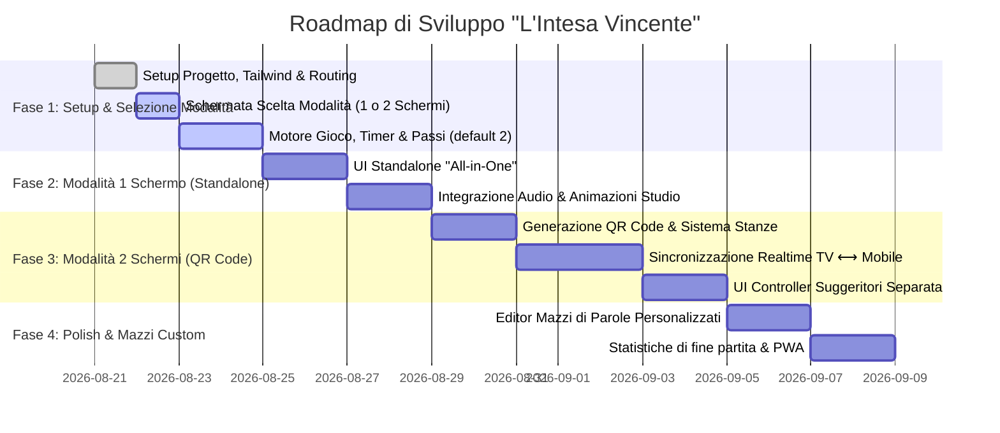

# 🎯 Progetto: Web App "L'Intesa Vincente" (Reazione a Catena)

Un'applicazione web interattiva, moderna, modulare e responsiva per giocare con amici al celebre gioco **"L'Intesa Vincente"** del programma televisivo *Reazione a Catena*.

---

## 📌 1. Visione del Progetto & Scelta Iniziale Modalità

All'avvio dell'applicazione, gli utenti visualizzano una schermata iniziale (**Landing / Mode Selector**) che consente di scegliere immediatamente tra due modalità di fruizione:

```
                  ┌──────────────────────────────────────────────┐
                  │          L'INTESA VINCENTE (Home)            │
                  │   Seleziona la modalità di gioco desiderata  │
                  └──────────────────────┬───────────────────────┘
                                         │
                 ┌───────────────────────┴───────────────────────┐
                 ▼                                               ▼
   ┌───────────────────────────┐                   ┌───────────────────────────┐
   │  📱 GIOCA CON UN SCHERMO  │                   │  📺 GIOCA CON DUE SCHERMI │
   │       (Standalone)        │                   │         (QR Code)         │
   ├───────────────────────────┤                   ├───────────────────────────┤
   │ • Un solo smartphone/PC   │                   │ • Schermo 1: TV/Tabellone │
   │ • Tabellone + Comandi     │                   │ • Schermo 2+: Smartphone  │
   │ • Nessuna configurazione  │                   │ • Accoppiamento QR Code   │
   └───────────────────────────┘                   └───────────────────────────┘
```

1. **📱 Modalità 1 Schermo (Standalone / Dispositivo Singolo)**:
   - Ideale per giocare subito con un solo telefono, tablet o computer.
   - Schermata compatta "tutto-in-uno" che mostra parola segreta, timer, contatore punteggio, indicatore dei passi e pulsanti di convalida (`Indovinata`, `Errore`, `Passo`).
   - Opzione *Privacy Parola* (il risponditore sta di fronte ai suggeritori e non guarda lo schermo).

2. **📺📱 Modalità 2 o Più Schermi (Multi-Device con QR Code / Stanza)**:
   - Ideale per serate in salotto: un PC o Smart TV proietta il **Tabellone TV** dello studio (Timer gigante, punteggio, jingle e suoni).
   - Il tabellone mostra un **QR Code** e un **Codice Stanza a 4 cifre**.
   - I giocatori inquadrano il QR Code con lo smartphone ed entrano come:
     - **🗣️ Suggeritore (Smartphone)**: Visualizza la parola segreta e la pulsantiera touch rapida.
     - **🎯 Risponditore (Smartphone/Schermo)**: Non vede la parola segreta, vede solo il timer e lo stato del turno.
     - **📺 Tabellone TV (Host)**: Gestisce gli effetti visivi, sonori e il countdown.

---

## 🎮 2. Regole e Meccaniche di Gioco

### A. Gestione del "Passo" (Default: 2)
- **Valore Predefinito**: **2 Passi** per turno (configurabile nelle opzioni da 0 a illimitati).
- **Indicatori Visivi**: Badge con indicatori dei passi disponibili (es. `2/2 🟢🟢` ➡️ `1/2 🟢⚪` ➡️ `0/2 ⚪⚪`).
- **Esaurimento Passi**: Al raggiungimento di `0` passi residui, il pulsante **"Passo"** si disabilita automaticamente (oppure applica una penalità aggiuntiva se abilitata nelle impostazioni).

### B. Tabella Punteggi e Azioni

| Azione | Effetto Punteggio | Effetto Passi | Feedback Audio & Visivo |
| :--- | :--- | :--- | :--- |
| **Parola Indovinata** | **+1 Punto** | Invariato | Suono campanella/dong + flash verde |
| **Errore** | **-1 Punto** (o 0) | Invariato | Suono buzzer grave + flash rosso |
| **Passo** *(con disponibilità)* | **-1 Punto** (o 0) | **-1 Passo residuo** | Suono swoosh + spegnimento badge passo |
| **Passo Esaurito** | Azione bloccata | Nessuno | Icona bloccata / Animazione shake |

### C. Regole per i Suggeritori:
- Una sola parola a testa in modo strettamente alternato.
- Divieto assoluto di usare radici etimologiche della parola target.
- Domanda sintatticamente completa e corretta.

---

## 📐 3. Linee Guida di Codice, Nomenclatura & DRY

Per garantire manutenibilità, leggibilità e modularità, il codice segue tassativamente questi principi:

### A. Convenzione di Nomenclatura Unificata
- **Variabili, Proprietà e Funzioni**: Rigorosamente in `camelCase` (es. `remainingPasses`, `handleCorrectAnswer`, `gameMode`, `isWordVisible`).
- **Componenti React & Tipi/Interfacce**: In `PascalCase` (es. `ModeSelector`, `ScoreBoard`, `PassIndicator`, `ActionPad`).
- **Costanti Globali & Configurazioni**: In `UPPER_SNAKE_CASE` (es. `DEFAULT_TIMER_SECONDS`, `DEFAULT_MAX_PASSES`, `GAME_MODES`).
- **Custom Hooks**: Prefisso `use` in `camelCase` (es. `useGameTimer`, `usePassesManager`, `useSoundEffects`, `useRoomSync`).

### B. Principio DRY & Modularità
- **Codice Comune Riutilizzabile**: La logica di calcolo del punteggio, la gestione dei passi e il timer sono identici sia in modalità *Standalone* che in modalità *Multi-Screen*, estratti in hook (`useGameState`, `usePassesManager`, `useGameTimer`).
- **Componenti Atomici**: Componenti UI separati e incapsulati con responsabilità singola (SRP).
- **Controllo e Verifica Post-Sviluppo**: Verifica dell'assenza di listener appesi, pulizia `setInterval`, conformità dei tipi e assenza di codice duplicato.

---

## 🛠️ 4. Stack Tecnologico

- **Frontend**: **React** (con **Vite**) o **Next.js**
- **Styling**: **Tailwind CSS** + **Framer Motion** (animazioni fluide del tabellone e countdown)
- **Audio Engine**: **Howler.js** o **Web Audio API** (effetti sonori a latenza zero)
- **Real-time Sync**: **Socket.IO** (o **Supabase / Firebase Realtime**) per la sincronizzazione QR Code
- **QR Code Engine**: **qrcode.react** per la generazione istantanea del QR Code di stanza
- **Icons**: **Lucide React**

---

## 📂 5. Struttura del Codice (Modulare & Scalabile)

```
intesa-vincente/
├── public/
│   ├── sounds/                     # Effetti sonori (.mp3 / .wav)
│   │   ├── correct.mp3
│   │   ├── error.mp3
│   │   ├── pass.mp3
│   │   ├── tick.mp3
│   │   └── timeout.mp3
│   └── favicon.ico
├── src/
│   ├── assets/                     # Immagini, loghi e grafiche
│   ├── config/                     # Costanti globali di configurazione
│   │   └── gameConfig.js           # DEFAULT_MAX_PASSES, DEFAULT_TIMER, GAME_MODES
│   ├── data/
│   │   ├── words.json              # Mazzo base di oltre 1000 parole
│   │   └── categories.json         # Categorie e livelli di difficoltà
│   ├── components/
│   │   ├── home/                   # Schermata iniziale selezione modalità
│   │   │   ├── ModeSelector.jsx    # Scelta 1 Schermo (Standalone) vs 2 Schermi (QR)
│   │   │   └── HeroHeader.jsx      # Titolo e grafica studio TV
│   │   ├── common/                 # Componenti UI generici riutilizzabili
│   │   │   ├── Button.jsx          # Bottone con sound & haptic feedback
│   │   │   ├── Modal.jsx           # Modale generica per impostazioni/fine partita
│   │   │   ├── PassIndicator.jsx   # Visualizzazione badge dei passi rimasti (2/2)
│   │   │   └── AudioToggle.jsx     # Switch muto/audio ON
│   │   ├── standalone/             # Vista Modalità 1 Schermo (Tutto-in-uno)
│   │   │   └── StandaloneGame.jsx  # Schermata integrata timer + parola + tasti
│   │   ├── board/                  # Vista Modalità 2 Schermi: Schermo TV / Tabellone
│   │   │   ├── GameTimer.jsx       # Countdown circolare grande
│   │   │   ├── ScoreDisplay.jsx    # Visualizzazione punteggio squadre
│   │   │   └── WordReveal.jsx      # Effetto comparsa parola
│   │   ├── controller/             # Vista Modalità 2 Schermi: Smartphone Suggeritori
│   │   │   ├── CurrentWordCard.jsx # Scheda parola segreta in corso
│   │   │   ├── ActionPad.jsx       # Pulsanti Giusto, Sbagliato, Passo
│   │   │   └── GameMasterBar.jsx   # Pausa, Annulla, Regola Tempo
│   │   └── lobby/                  # Creazione stanza multi-schermo e QR Code
│   │       ├── QrCodeDisplay.jsx   # Generatore QR Code e Room Code
│   │       ├── RoleSelector.jsx    # Selezione Suggeritore / Risponditore / TV
│   │       └── SettingsForm.jsx    # Configurazione tempo e max passi (default 2)
│   ├── hooks/                      # Custom React Hooks (Logica isolata)
│   │   ├── useGameTimer.js         # Countdown preciso con Web Worker o requestAnimationFrame
│   │   ├── useGameState.js         # Stato centrale (parola corrente, punti, storico)
│   │   ├── usePassesManager.js     # Logica dedicata ai passi residui (default 2)
│   │   ├── useSoundEffects.js      # Riproduzione audio con precaricamento
│   │   └── useRoomSync.js          # Sincronizzazione WebSocket tra schermi
│   ├── utils/                      # Funzioni pure di utilità (DRY)
│   │   ├── timeFormatter.js        # Formattazione minuti:secondi (mm:ss)
│   │   ├── deckManager.js          # Mescolamento, filtri e anti-ripetizione parole
│   │   └── soundPlayer.js          # Helper per trigger suoni
│   ├── styles/
│   │   └── index.css               # Tailwind & animazioni personalizzate
│   ├── App.jsx                     # Router / State container principale
│   └── main.jsx
├── progetto.md
├── package.json
├── tailwind.config.js
└── vite.config.js
```

---

## 🗺️ 6. Roadmap di Sviluppo Dettagliata



### Dettaglio delle Fasi di Sviluppo

#### 🟢 Fase 1: Setup, Schermata Iniziale & Motore di Gioco
- Inizializzazione progetto con **Vite + React + Tailwind CSS**.
- Creazione del componente **`ModeSelector.jsx`**: visualizzazione schede "Gioca con 1 Schermo" e "Gioca con 2 Schermi (QR Code)".
- Definizione costanti globali (`DEFAULT_TIMER_SECONDS = 60`, `DEFAULT_MAX_PASSES = 2`).
- Creazione dei custom hook per la logica core (`useGameState.js`, `usePassesManager.js`, `useGameTimer.js`).

#### 🟡 Fase 2: Modalità 1 Schermo (Standalone / Singolo Dispositivo)
- Costruzione della schermata all-in-one per giocare direttamente dal proprio smartphone/PC.
- Tasti grandi ad alta visibilità (`Indovinata`, `Errore`, `Passo` con blocco a 0 passi).
- Integrazione motore audio con `Howler.js` (jingle inizio, dong corretto, buzzer errore, sirena tempo scaduto).
- Animazioni con Framer Motion (flash e zoom del tabellone).

#### 🔵 Fase 3: Modalità 2 Schermi (Tabellone TV + Smartphone via QR Code)
- Generazione dinamica del **QR Code** con `qrcode.react` e codice alfanumerico della stanza.
- Sincronizzazione in tempo reale (Socket.IO o Supabase/Firebase):
  - **Schermo 1 (TV/Host)**: Mostra solo il tabellone gigante e l'audio.
  - **Schermo 2+ (Suggeritori)**: Ricevono in tempo reale la parola segreta e i pulsanti di controllo.
  - **Schermo 3 (Risponditore)**: Schermo nero/timer senza svelamento parola.

#### 🟣 Fase 4: Personalizzazione, Statistiche & PWA
- Modale impostazioni: regolazione durata timer, personalizzazione numero di passi (default 2, 0-5 o infiniti).
- Editor mazzi parole personalizzate (file JSON/CSV o inserimento manuale).
- Schermata di riepilogo con statistiche (parole indovinate, errori, passi usati, tempo medio per risposta).
- Configurazione PWA per l'installazione su smartphone a tutto schermo.

---

## 🔍 7. Checklist di Verifica Qualità del Codice (Self-Check)

Prima di considerare completata ogni feature, verificare i seguenti punti:
- [ ] **DRY**: Nessuna funzione o blocco logico duplicato (logica condivisa tra modalità 1 schermo e 2 schermi).
- [ ] **Nomenclatura**: Nomi chiari e coerenti in `camelCase` per funzioni/variabili e `PascalCase` per componenti.
- [ ] **Modularità**: Componenti atomici ben separati (`common/`, `home/`, `standalone/`, `board/`, `controller/`, `lobby/`).
- [ ] **Pulizia Timer/Listener**: `clearInterval` e cleanup delle connessioni WebSocket negli `useEffect`.
- [ ] **Touch & Responsive**: Dimensioni dei pulsanti e contrasto ottimali su qualsiasi dimensione di schermo.
